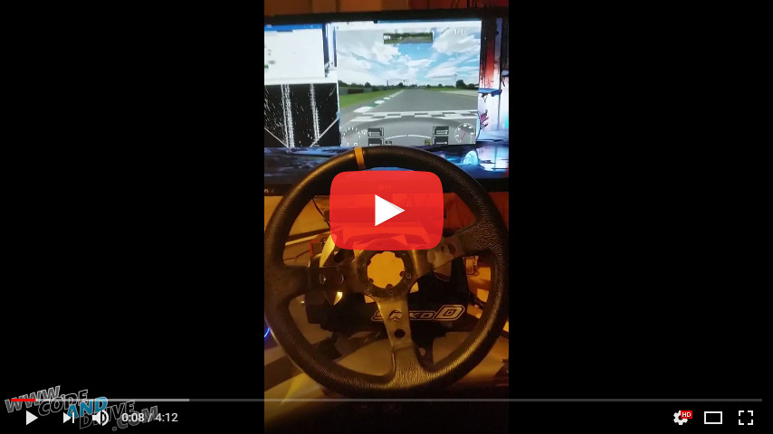

AutoCruise
: .Net vision based cruise and steer controller
=========================================================

# Installation
* Get LiveForSpeed [www.lfs.net](http://www.lfs.net)
1. Change outgauge config accordingly:  
'OutGauge Mode 1'  
'OutGauge Delay 1'  
'OutGauge IP 127.0.0.1'  
'OutGauge Port 666'  
'OutGauge ID 0'
Recommended view settings (for XFG):
(lfs_view_settings.png)
2. Use keys: I(forward), J(left), K(back), L(right), Y(gear up), H(gear down), U(ignition) to configure vJoy axis in LFS
* Install vJoy (default settings should work)
* For Ffb steering you need LogitechSDK compliant wheel

# Versions

## 2.2 - Work in progress
- Change FFB from spring to custom constant force implementation
- Add Radiant sliding window algorithm
- Add Polymonial fit for lanes
- Increase FOV + change perspective

## 2.1
+ Clean up module initialization
+ Add IoC
+ Establish solid control pipeline

## 2.0
+ LogitechSDK FFB steering
+ Quick SharpDX screen capture

## 1.0
+ Analog vJoy control